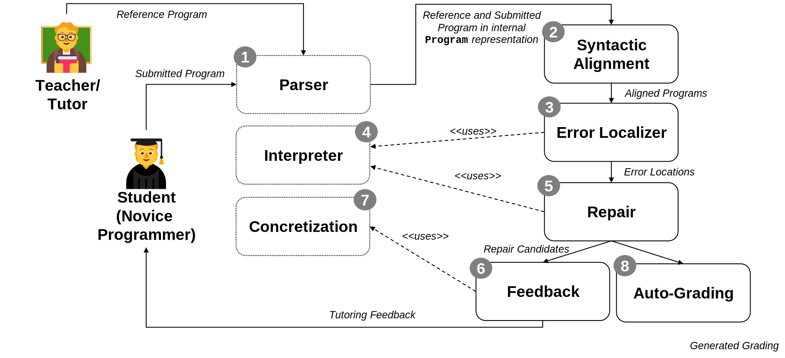

## Intelligent Tutoring System

The high-level idea of the Intelligent Tutoring System is to introduce an automated technique to provide
feedback and grading suggestions for programming assignments. As shown in above figure, for a given
programming assignment, the tutor would provide a reference solution and some test cases, while the
student would submit a solution and would receive feedback for that. The feedback should go beyond
the simple execution of test cases, but should tell the student where and how to fix the submission. More
sophisticated and gradual ways of feedback could be also introduced.

Developing such a system includes many conceptual and technical challenges. We summarized some
of them into projects, from which you will need to choose one for this course. Please find below a
collection of all projects, and more detailed descriptions on the following pages. We group projects by
their provided functionalities. Each project has assigned estimated difficulty levels (Low, Medium, High)
in the categories: coding (i.e., programming intensity), theoretical complexity (i.e., need for background
study), amount of research involved (i.e., be innovative and create something new), and the involvement
of HCI (Human-Computer Interaction) aspects.

## Workflow

## Project List

- **Parser**
- **Interpreter**
- **Alignment**
- **Repair**
- **Feedback**